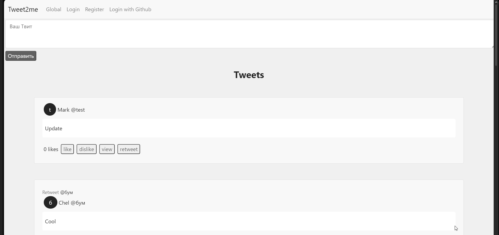

## Tweet2me

Basic Twitter clone created back in the beginning of 2023 with *ReactJS* and *Django-Rest-Framework*. Project built as SPA and deployed in *Docker* containers with *PostgreSQL* as database. The main purpose of this project was learning experience in CORS, session cookies, oauth, responsive site creation, working with many to many relationships in database, and other framework-specific knowledge.
_________________________
## Table of Contents
- [Functionalities](#Functionalities)
- [Technologies](#technologies)
- [Installation](#installation)
- [Example](#usage)
____________________________
## Functionalities

- Users can register and login in order to have a profile.
- Profiles can be updated.
- Only logged in users can post tweets and retweets.
- Any profile can be followed and unfollowed accordingly.
- Following a profile shows their tweets and retweets in your feed.
- User can mark tweet as seen to remove it from feed.
- Users can like and dislike tweets.
- Users can discover each other through the global page.

## Technologies

*Python 3.7, JavaScript, CSS, HTML, Bootstrap, Django 3.2.18, djangorestframework 3.14, React ^18.2.0, Docker, oauth*

## Installation

1. Clone the project with `git clone https://github.com/Lixerus/Tweet2me.git`
2. In root folder with cmd run `docker-compose build`
3. Then run the command `docker-compose up`
4. Wait for all containers to start and go to *http://localhost:3000* in your browser.
5. To stop the app, run `docker-compose down`

>*Note* : While creating an image for the backend, some dependancies changed since and docker-compose couldn't build. I upgraded Python version to 3.8 in the Dockerfile and also deleted `install==1.3.5` in requirements.txt because pip couldn't find it. I didn't find any signs of anything breaking after the changes.

## Example

Basic usage scenario

